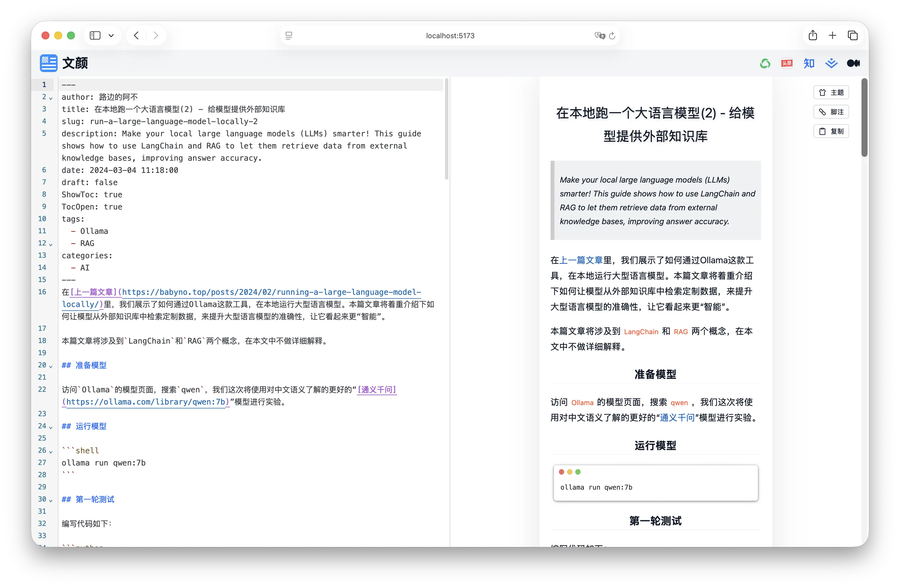

<div align="center">
    
</div>

# 文颜 UI 库

`@wenyan-md/ui` 是 Wenyan 生态中的 **UI 层**，封装了 Markdown 编辑、渲染预览、主题选择等通用界面组件，可同时服务于：

* Web App（SvelteKit）
* 桌面应用（Tauri / macOS）
* 内嵌式工具（WebView / IFrame）

**Web App 截图**



## 特性

* **组件化设计**
  所有功能以 Svelte 组件形式提供，可按需引入

* **内置主题与样式系统**
  基于 `@wenyan-md/core` 的主题 / 高亮主题能力

* **Markdown 编辑 + 实时预览**
  基于 CodeMirror 6

* **与 wenyan-core 解耦**
  UI 只负责交互与展示，渲染逻辑完全交给 core

* **Web / Desktop 通用**
  不依赖浏览器特有 API，适配 WebView / Tauri

## 安装

```bash
npm install @wenyan-md/ui
```

> [!NOTE]
> 
> 本项目是 **Svelte 组件库**，仅适用于 Svelte 5 项目。

## 快速开始

### 在 Svelte 项目中引入

```svelte
<script lang="ts">
  import { Editor, Preview } from "@wenyan-md/ui";
</script>

<Editor />
<Preview />
```

> 具体组件名称以实际导出为准（下文示例）

### Tailwind CSS 配置

确保你的项目中已正确配置 Tailwind：

```ts
// tailwind.config.ts
export default {
  content: [
    "./src/**/*.{html,js,svelte,ts}",
    "./node_modules/@wenyan-md/ui/**/*.{svelte,js}"
  ],
  theme: {
    extend: {}
  },
  plugins: []
};
```

## 组件设计理念

### UI 与逻辑分离

```text
@wenyan-md/ui
  └─ 负责：
     - 编辑器 UI
     - 主题选择
     - 交互状态
     - 用户体验

@wenyan-md/core
  └─ 负责：
     - Markdown 解析
     - 数学公式
     - CSS 主题
     - 微信渲染规则
```

UI 层 **不会**：

* 解析 Markdown
* 操作 MathJax
* 直接处理 DOM 样式

## 组件分类（示意）

```text
components/
├─ editor/
│  └─ MarkdownEditor.svelte
├─ preview/
│  └─ PreviewPane.svelte
├─ theme/
│  ├─ ThemeSelector.svelte
│  └─ HighlightThemeSelector.svelte
├─ layout/
│  └─ SplitView.svelte
└─ common/
   ├─ Button.svelte
   └─ Select.svelte
```

## 使用场景

* Wenyan Web 版
* Wenyan macOS 客户端
* Wenyan PC（Tauri）
* 内部 CMS / 编辑器
* Markdown → 微信工具

## 注意事项

* 本库 **不是** 独立应用
* 不包含路由 / 页面
* 不直接操作文件系统
* 不依赖 Node API

## 项目关系

```text
@wenyan-md/core   ← 核心逻辑（渲染 / 发布）
        ↑
@wenyan-md/ui     ← UI 组件库
        ↑
@wenyan-md/web    ← Web App
wenyan-macos      ← 桌面端（WebView）
wenyan-pc         ← 桌面端（Tauri）
```

## 赞助

如果你觉得文颜对你有帮助，可以给我家猫咪买点罐头 ❤️

[https://yuzhi.tech/sponsor](https://yuzhi.tech/sponsor)

## License

Apache License Version 2.0
